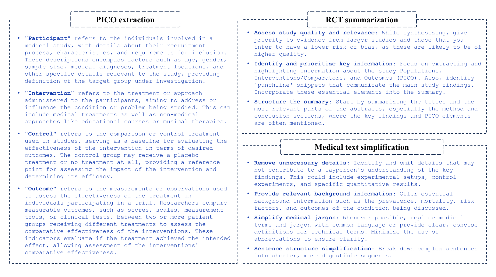

# Benchmarking Large Language Models in Evidence-Based Medicine

Evidence-based medicine (EBM) represents a paradigm of providing patient care grounded in the most current and rigorously evaluated research. Recent advances in large language models (LLMs) offer a potential solution to transform EBM by automating labor-intensive tasks and thereby improving the efficiency of clinical decision-making.
This study explores integrating LLMs into the key stages in EBM, evaluating their ability across evidence retrieval (PICO extraction, biomedical question answering), synthesis (summarizing randomized controlled trials), and dissemination (medical text simplification). We conducted a comparative analysis of seven LLMs, including both proprietary and open-source models, as well as those fine-tuned on medical corpora. Specifically, we benchmarked the performance of various LLMs on each EBM task under zero-shot settings as baselines, and employed prompting techniques, including in-context learning, chain-of-thought reasoning, and knowledge-guided prompting to enhance their capabilities.

## Detailed task descriptions

Four tasks in evidence-based medicine are benchmarked in our code, including PICO extraction, biomedical question answering (QA), summarizing randomized controlled trials (RCT), and medical text simplification. 

You can modify the parameters in the corresponding Jupyter notebook to get results. Specifically, `GPT` allows you to select different large language models to use for the tasks. Parameter `prompt_type` controls the prompting style used for the tasks. The available options include: `base`, `1shot`, `3shot`, `5shot`, and `guide`. Note that for the biomedical QA task, `guide` will return the results of Chain-of-Thought (CoT) prompting.


### PICO extraction

PICO extraction is the task of identifying the key components of a clinical study from its text, namely the Population, Intervention, Comparison or Control, and Outcome. The dataset for PICO extraction can be downloaded from: https://github.com/BIDS-Xu-Lab/section_specific_annotation_of_PICO/tree/main/data/EBM-NLPmod

### Biomedical QA

Biomedical question answering is the task of answering natural language questions about biomedical topics using relevant information from a given corpus of text. The dataset for biomedical QA can be downloaded from: https://microsoft.github.io/BLURB/tasks.html#dataset_bioasq-taskb  
https://pubmedqa.github.io/

### RCT summarizaiton 
Generating high-quality summaries that synthesize evidence from clinical trials is crucial for enabling evidence-based medicine. These summaries allow practitioners to quickly understand the key findings, strengths, limitations, and implications across relevant trials on a topic. The input is the titles and abstracts of RCTs included in a Cochrane review, and the target is the Authors' Conclusions from the review abstract. The dataset for RCT summarization can be downloaded from: https://github.com/bwallace/RCT-summarization-data

### Medical text simplification
Medical text simplification refers to the process of simplifying complex medical text to make it more understandable, especially for patients and caregivers with limited health literacy. The dataset for medical text simplification can be downloaded from: https://github.com/nikhilpriyatam/medical_text_simplification/tree/master/data


## Deployment for open-source models

Open-source models including FLAN-UL2, Med-Alpaca, and PMC-LLaMA can be deployed using the `Transformers` library from HuggingFace. Here is an example code for each model using `Tokenizer` and model instantiation:

FLAN-UL2:
```
from transformers import AutoTokenizer, AutoModelForSeq2SeqLM

tokenizer = AutoTokenizer.from_pretrained("google/flan-ul2")
model = AutoModelForSeq2SeqLM.from_pretrained("google/flan-ul2")
```

Med-Alpaca:
```
from transformers import AutoTokenizer, AutoModelForCausalLM

tokenizer = AutoTokenizer.from_pretrained("medalpaca/medalpaca-7b")
model = AutoModelForCausalLM.from_pretrained("medalpaca/medalpaca-7b")
```

PMC-LLaMA:
```
from transformers import AutoTokenizer, AutoModelForCausalLM

tokenizer = AutoTokenizer.from_pretrained("axiong/PMC_LLaMA_13B")
model = AutoModelForCausalLM.from_pretrained("axiong/PMC_LLaMA_13B")
```

Alternatively, you can use the `pipeline` interface in `Transformer` library for simpler access that abstracts away most of the lower-level steps involved in setting up and using these models. It offers a more streamlined and straightforward way to interact with the models for typical tasks.


## Prompting strategies

Knowledge-guided prompting and CoT prompting enhance large language models in specialized medical tasks. Knowledge-guided prompting integrates domain-specific expertise, improving accuracy in tasks like PICO extraction and RCT summarization by providing clear definitions and structured guidelines:



CoT prompting encourages LLMs to articulate their reasoning step-by-step, leading to better performance in biomedical question answering. In the BioASQ dataset, a basic prompt like _"please respond with 'yes' or 'no'"_ is enhanced to _"please first respond with 'yes' or 'no,' followed by a brief explanation of your reasoning process, ensuring that your explanation aligns with the study's findings."_ Similarly, for the PubMedQA dataset, the prompt becomes _"please first respond with 'yes,' 'no,' or 'maybe,' and then provide a detailed explanation in 1-2 sentences."_


## License

This project is licensed under the Apache License 2.0 - see the [LICENSE.md](LICENSE.md) file for details

## Acknowledgments

* https://github.com/BIDS-Xu-Lab/section_specific_annotation_of_PICO
* https://github.com/BIDS-Xu-Lab/Clinical_Entity_Recognition_Using_GPT_models
